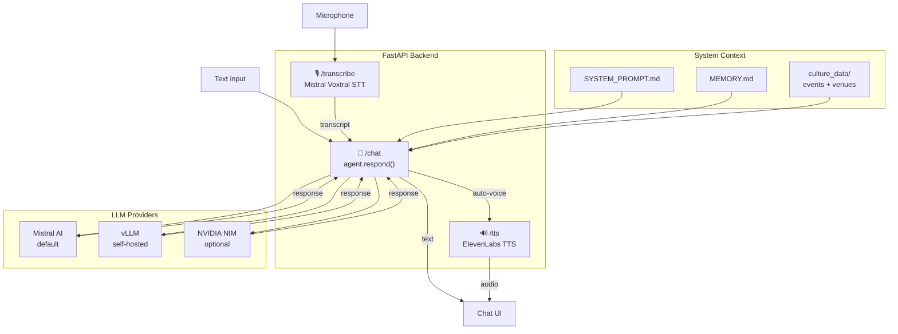

# Monaco Cultural Agent

> **Mistral Hackathon 2026** — A conversational AI agent specialized in cultural events and venues in the Principality of Monaco.

## Demo

[](https://www.youtube.com/watch?v=dQw4w9WgXcQ)

## Overview

Monaco Cultural Agent is a full-stack web application that lets users ask questions about cultural events, exhibitions, shows, cinema, theatre, museums, and more in Monaco. The agent answers using real scraped data, supports voice input (speech-to-text via Mistral Voxtral), voice output (text-to-speech via ElevenLabs), and multiple LLM providers.

Designed with **sovereignty and privacy in mind**: the entire stack can run fully on-premise — LLM inference, STT, and data — with no dependency on external cloud APIs, using local hardware such as the NVIDIA DGX SPARK GB10. It is also ready to plug into official data sources (open data feeds, institutional APIs) to replace scraping entirely and guarantee data freshness.

### Key Features

- **Conversational chat** about Monaco cultural events, grounded in real data (no hallucination).
- **Multi-language support** — the agent replies in the same language as the user (English, French, Italian, Russian, Spanish, etc.).
- **Voice input** — record a question via microphone, transcribed by Mistral Voxtral STT.
- **Voice output** — every agent response can be played aloud via ElevenLabs TTS, with an embedded audio player.
- **Date-aware filtering** — understands relative periods ("this weekend", "next week") and absolute dates to show only relevant events.
- **Multiple LLM providers** — switch between Mistral AI, NVIDIA NIM, or a fully local model via LM Studio — from the sidebar.
- **Local & sovereign inference** — run the full stack on-premise (tested on NVIDIA DGX SPARK GB10) with no external API dependency.
- **Official source ready** — architecture supports direct integration of open data APIs or institutional feeds to replace scraping.
- **Dark / Light theme** toggle.

## Architecture

```
User (browser)
  │
  ├── /chat          → FastAPI → agent.respond() → LLM (Mistral / vLLM / NVIDIA)
  ├── /transcribe    → FastAPI → Mistral Voxtral STT
  ├── /tts           → FastAPI → ElevenLabs TTS
  ├── /voices        → FastAPI → ElevenLabs voice list
  └── /last-scraped  → FastAPI → latest scrape timestamp from event data
```



### Tech Stack

- **Backend**: Python, FastAPI, Uvicorn
- **LLM**: Mistral AI (default), NVIDIA NIM, or any vLLM-compatible endpoint — all via OpenAI-compatible API
- **STT**: Mistral Voxtral (`voxtral-mini-latest`)
- **TTS**: ElevenLabs (`eleven_multilingual_v2`)
- **Frontend**: Single-page HTML/CSS/JS (no build step, no framework)
- **Data**: JSON event files + Markdown venue descriptions, produced by an external scraper

## Project Structure

```
mistralHackaton2026/
├── main.py                    # FastAPI app — API routes and static file serving
├── requirements.txt           # Python dependencies
├── .env.example               # Environment variable template
├── SYSTEM_PROMPT.md           # Agent role, rules, and output format
├── MEMORY.md                  # Persistent context (data layout, schema)
│
├── agent/
│   ├── __init__.py            # Core logic: context loading, date parsing, respond()
│   ├── providers.py           # LLM provider configs and chat() function
│   ├── voxtral.py             # Mistral Voxtral speech-to-text
│   └── elevenlabs_tts.py      # ElevenLabs text-to-speech
│
├── static/
│   └── index.html             # Chat UI (HTML + CSS + JS)
│
└── culture_data/
    ├── categories.json        # Event/venue taxonomy (Cinema, Theatre, Museum, etc.)
    ├── sources.json           # Scraper source definitions
    ├── *.md                   # Venue descriptions (generated by scraper)
    └── events_*.json          # Event data per venue (generated by scraper)
```

## Setup

### 1. Clone the repository

```bash
git clone <repo-url>
cd mistralHackaton2026
```

### 2. Create a virtual environment and install dependencies

```bash
python -m venv venv
source venv/bin/activate   # Linux/macOS
venv\Scripts\activate      # Windows
pip install -r requirements.txt
```

### 3. Configure environment variables

Copy the example file and fill in your API keys:

```bash
cp .env.example .env
```

| Variable | Required | Description |
|----------|----------|-------------|
| `MISTRAL_API_KEY` | Yes | Mistral AI API key (used for LLM chat + Voxtral STT) |
| `ELEVENLABS_API_KEY` | Yes | ElevenLabs API key (used for TTS) |
| `NVIDIA_API_KEY` | No | NVIDIA NIM API key (optional provider) |
| `VLLM_BASE_URL` | No | vLLM endpoint URL (optional provider) |
| `VLLM_API_KEY` | No | vLLM API key |
| `VLLM_MODEL` | No | vLLM model name |

### 4. Run the scraper to populate event data

See the [Scraper](#scraper) section below.

### 5. Start the application

```bash
python main.py
```

The app runs on `http://localhost:7860`.

## API Endpoints

| Method | Path | Description |
|--------|------|-------------|
| `GET` | `/` | Serves the chat UI (`static/index.html`) |
| `POST` | `/chat` | Send a message to the agent. Body: `{ message, history, provider, model }` |
| `POST` | `/transcribe` | Upload an audio file for speech-to-text (Voxtral) |
| `POST` | `/tts` | Convert text to speech (ElevenLabs). Body: `{ text, voice_id }` |
| `GET` | `/voices` | List available ElevenLabs voices |
| `GET` | `/last-scraped` | Get the timestamp of the most recent data scrape |

## How It Works

1. **User sends a message** (text or voice) via the chat UI.
2. If voice input: the audio is sent to `/transcribe` (Voxtral STT), then the transcribed text is sent to `/chat`.
3. The backend **detects the user's language** (`langdetect`) and injects a language instruction into the system prompt.
4. The backend **extracts date references** from the message (`dateparser`) to filter events by the relevant time period.
5. A **system prompt** is assembled from:
   - `SYSTEM_PROMPT.md` (role, rules, output format)
   - `MEMORY.md` (data schema knowledge)
   - Filtered culture data (venues + events matching the detected date range)
   - Language instruction
6. The full message history + system prompt is sent to the **LLM** (Mistral by default).
7. The LLM responds following a strict format (intro + numbered event list), which the frontend **parses and renders** as styled event cards with dates, venues, prices, and links.
8. If auto-voice is enabled, the response is sent to `/tts` (ElevenLabs) and played back with an embedded audio player.

## Culture Data

Event and venue data lives in the `culture_data/` folder:

- **`categories.json`** — Taxonomy with 12 categories (Cinema, Theatre, Concerts, Museum, Opera, Grand Prix, etc.) and their associated tags.
- **`sources.json`** — Scraper source definitions (culture.mc, Grimaldi Forum, RSS feeds, etc.).
- **`*.md`** — Markdown venue descriptions (hours, prices, collections, access info).
- **`events_*.json`** — Event arrays per venue. Each event has: `id`, `lieu_id`, `lieu_nom`, `titre`, `description`, `date_start`, `date_end`, `heure_debut`, `heure_fin`, `tags`, `tarif`, `gratuit`, `url`, `image_url`, `source`, `scraped_at`.

The `.md` and `.json` files in `culture_data/` are gitignored as they are generated by the scraper.

## Scraper

The scraper populates `culture_data/` with structured event data. It runs independently from the main app.

### Pipeline

```
sources.json → fetch.py → extract.py → store.py
(venue config)  (Linkup/Tavily)  (Mistral Large)  (JSON upsert)
```

1. **Fetch** — fetches URLs directly via Linkup (JS rendering) or searches the web via Tavily
2. **Extract** — sends raw content to Mistral Large, which returns structured JSON events
3. **Store** — upserts events into `culture_data/events_<venue_id>.json` (no duplicates)

### Usage

```bash
python3 scraper/run.py                          # all venues
python3 scraper/run.py --venue cinema_monaco    # single venue
python3 scraper/run.py --dry-run                # extract without saving
python3 scraper/run.py --debug --venue grimaldi_forum  # print raw fetched content
```

### Venues

| Venue | Method | Store mode |
|-------|--------|------------|
| Musée Océanographique | Tavily search + URL | UPSERT |
| Grimaldi Forum | Tavily search only | UPSERT |
| Cinémas de Monaco | Linkup direct fetch | REPLACE (weekly) |
| Médiathèque de Monaco | Linkup direct fetch | UPSERT |
| Théâtre des Muses | Linkup direct fetch | UPSERT + PRUNE (season 2025-2026) |
| Théâtre Princesse Grace | Linkup direct fetch | UPSERT + PRUNE (season 2025-2026) |

**Store modes:**
- **UPSERT** — adds new events, preserves existing ones (deduplication by `venue_id + title + date_start`)
- **REPLACE** — replaces all events on each run (e.g. cinema weekly schedule)
- **PRUNE** — automatically removes past events for seasonal venues

### Scheduling

Recommended: daily cron at 3:00 AM.

```cron
0 3 * * * cd /path/to/mistralHackaton2026 && python3 scraper/run.py >> logs/scraper.log 2>&1
```

See [`scraper/README.md`](scraper/README.md) for full configuration reference.

## LLM Providers

The agent supports multiple LLM providers, switchable from the UI sidebar:

| Provider | Models | Status | Notes |
|----------|--------|--------|-------|
| **Mistral** | `ministral-8b-latest`, `mistral-large-latest`, `mistral-small-latest` | ✅ Tested | Default provider. Uses Mistral AI API. |
| **NVIDIA NIM** | `mistralai/ministral-14b-instruct-2512`, `mistralai/mistral-large-3-675b-instruct-2512` | ✅ Tested | Uses NVIDIA NIM API. |
| **LM Studio** | Configurable via `.env` | ✅ Tested | Local inference via LM Studio. Tested on **NVIDIA DGX SPARK GB10** for sovereign, on-premise inference. |
| **vLLM** | Configurable via `.env` | 🚧 In progress | Self-hosted vLLM endpoint. |

All providers use the OpenAI-compatible chat completions API.

## Limitations & Future Work

### Current Limitations

The agent's knowledge is entirely dependent on scraped data. If a venue's website changes structure, blocks crawlers, or publishes events late, the data may be incomplete or outdated. The scraper must be re-run manually (or via cron) to stay current — there is no real-time event feed.

### Roadmap

- [ ] **More venues** — add Opera de Monte-Carlo, Stade Louis II, Musée des Timbres et Monnaies, and other Monaco cultural institutions
- [ ] **Improved parsing** — better extraction of multi-date events, ticket prices, and venue details
- [ ] **Fully local & sovereign inference** — run the entire stack (LLM + STT + TTS) on-premise with no external API dependency, using hardware such as the NVIDIA DGX SPARK GB10
- [ ] **Real-time data** — integrate official event APIs or RSS feeds where available to reduce scraping dependency
- [ ] **User personalization** — remember user preferences (language, favourite venues, categories)

---

## Partners & APIs

This project was built during the **Mistral AI Hackathon 2026** and relies on the following technologies and services:

| Partner | Usage |
|---------|-------|
| [**Mistral AI**](https://mistral.ai) | LLM chat (Ministral, Mistral Large), speech-to-text (Voxtral), and event extraction in the scraper |
| [**ElevenLabs**](https://elevenlabs.io) | Text-to-speech voice synthesis (`eleven_multilingual_v2`) |
| [**Linkup**](https://linkup.so) | JS-capable web fetching for dynamic venue websites |
| [**Tavily**](https://tavily.com) | Web search and static URL content extraction |
| [**NVIDIA**](https://www.nvidia.com) | NIM API for cloud inference + DGX SPARK GB10 for local sovereign inference |

---

## License

MIT License — see [LICENSE](LICENSE) for details.
